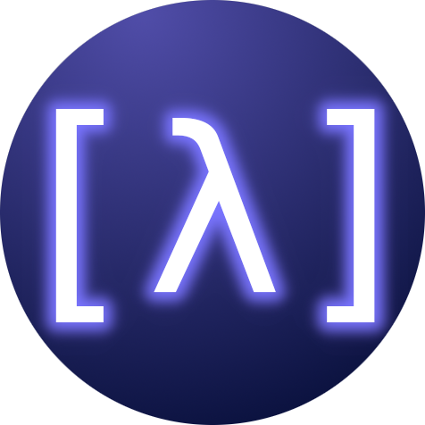

<h1 align="center">Sci-Lisp</h1>

<p align="center">

</p>

<h4 align="center" style="margin-top: 24px">
A Lisp for Scientific Computing written in Rust
</h4>

<p align="center">
<a href="https://github.com/chaploud/sci-lisp/actions/workflows/rust.yml"></a>
</p>


## Features (WIP)

- [x] REPL
- [x] Run as script
- [x] S-expression
- [x] Clojure-like syntax (), [], {}, etc...
- [x] Numpy-like array slice `([2|-1, -3|] arrayNd)`
- [ ] Multiparadigm (Functional, Object-Oriented and Procedural)
- [ ] Supports exception handling
- [ ] Functionality of IPython, numpy, matplotlib, pandas, scipy
- [ ] Digital Signal Processing (DSP) and Time Series Analysis (TSA) included as standard library
- [ ] Well documented
- [ ] Easy installation (Cross Platform)
- [ ] Great developer experience with VSCode extension

## Plan (WIP)

- JIT (Just In time) compile dynamically typed language
- Using Wasm(Web Assembly) for IR (Intermediate Representation) and directory execute from source code
- VM/Runtime is [wasmtime](https://github.com/bytecodealliance/wasmtime)

## Philosophy

Let's use **Lisp easily** without thinking too hard!

## Influenced by

- Common Lisp
- Clojure (https://github.com/clojure/clojure)
- Hy (https://github.com/hylang/hy)
- Python (https://github.com/python/cpython)
- Rust (https://github.com/rust-lang/rust)

## Installation

**NOTE:** currently most features are not implemented.

### Build from source code

#### Prerequests

- Latest Rust installation (see https://www.rust-lang.org/tools/install)

#### Commands

```bash
# Clone Repository
git clone https://github.com/chaploud/sci-lisp.git

# build scilisp binary using cargo build
cd sci-lisp
cargo build --release  # => target/release/scilisp
```

- You can execute `scilisp` binary

### Get prebuild binary

#### Windows

Not distributed yet.

#### Mac

Not distributed yet.

#### Linux

Not distributed yet.

## Command line options

```bash
scilisp         # launch REPL
scilisp xxx.sl  # run as script
```

## Sci-Lisp code examples

See `examples/example.sl`.

```clojure
; Comment

;; ===== Literal
"abc\n"             ; string
#"[0-9]+"           ; regular expression
false               ; false
true                ; true
nil                 ; nil
-999                ; i64
0b101               ; i64 (binary)
0o777               ; i64 (octal)
0xff                ; i64 (hex)
-3.14e15            ; f64
nan                 ; f64: Not a Number
inf                 ; f64: positive infinity
-inf                ; f64: negative infinity
-0.0                ; f64: negative zero
-1.2+3.4j           ; c64 (complex number)
:keyword            ; keyword symbol
'symbol             ; quoted symbol

;; falsy value is only 'false' and 'nil'
;; "", '(), [], {}, #{}, 0, nan => all truthy"

;; ===== Keywords (cannot use as symbol name)
;; false, true, nil,
;; def, const, set!,
;; defn, fn, return,
;; if, when, cond, switch,
;; while, for, break, continue
;; try, catch, finally, throw,
;; import, export
;; typedef

;; ===== Spceial Marks (cannot use in symbol name)
;; : => keyword
;; ' => quote
;; ` => syntax-quote
;; ~ => unquote
;; ~@ => unquote-splicing
;; @ => splicing
;; . => member access
;; | => slice
;; / => namespace(module)
;; & => rest(variable length argument), keyword argument

;; #i64 => type annotation (prefix)
;; local# => auto-gensym (suffix)

;; ===== Collection
; comma is treated as whitespace
'(1, "a", :b)                ; list
[1.0, 2.0, 3.0]              ; vector
{:a "a", :b "b", :c "c"}     ; map (holds the insersion order)
#{:a, :b, :c}                ; set (holds the insersion order)
(array [1, 2, 3])            ; array of i64 (like numpy)
;; NOTE: map key must be string, i64, keyword

;; ===== Datetime
(datetime 2021 1 1
          {:tz "UTC+09"})    ; => datetime
(duration {:hour 1})         ; => duration

;; ===== Function Call
(type [1, 2, 3])             ; show type
(time (+ 1 2))               ; measure processing time
(print [1, 2] "abc\n" 123)   ; print any

;; ===== Variable Binding
;; NOTE: Different from Clojure
;; => Define in local scope.
;; => Of course, if you define in top level it has global scope.

(def a "abcde")              ; variable (mutable, 'local' scope)
(const C [1, 2, 3])          ; constant value (immutable, 'local' scope)

([0|2] a)                    ; slice => "ab"
(-1 C)                       ; back => 3

;; NOTE: Only let and fn(clousure/lambda) can make scope in Sci-Lisp
(let [a 2]                   ; bind variable (make scope)
  (set! a 3)                 ; assign(destructive)
  a)                         ; => 3

(let                         ; make local scope only
  (def x 2)                  ; define in local scope
  x)                         ; => 2
x                            ; => error

;; ===== Function
(defn my-sum                 ; define function
  "sum two value"            ; docstring
  [a b]
  (return (+ a b))           ; can use early return
  (- a b))

(my-sum 1 2)                 ; => 3

((fn [x] (* x x)) 2)         ; => 4 (lambda/anonymus function)

;; ===== Control Flow
(if (< 2 3)                  ; if
  true                       ; true form
  false)                     ; false form (must)

(when (< 2 3)                ; when
  (do                        ; true form
    (print "2 < 3")          ; do multiple expressions
    "retval"))

(cond                        ; cond
  (< n 0) "negative"         ; (condition) (expresson)
  (> n 0) "positive"
  :else "default")           ; :else (expression)

(def val "hoge")
(switch val                  ; switch
  ["a"]                      ; match "a"
    (print "A")
  ["b", "c"]                 ; match "b" or "c"
    (print "B or C")
  :default                   ; :default (expression)
    (print "DEFAULT"))

(for [i (range 5)]           ; for loop, range
  (print i))                 ; range returns 'generator'
i                            ; => 4 you can access i after loop.

(def a 0)
(while (< a 10)              ; while loop
  (print a)
  (set! a (+ a 1))
  (if (> a 5)
    (break (+ a 9994))       ; break with return value
    (continue))              ; continue
  (print "never print"))

;; ===== Built-in Functions/Macros

;; Arithmetic
(inc 1)              ; add 1
(dec 1)              ; subtract 1
(+ 1 1)              ; Add
(- 1 1)              ; Subtract
(* 2 3)              ; product
(/ 1 2)              ; devide (float)
(// 1 2)             ; devide
(% 3 2)              ; remainder

;; Compare
(= 2 2 2)            ; equal
(!= 2 3)             ; not equal
(< 2 3)              ; less
(<= 2 3)             ; less equal
(> 2 3)              ; greater
(>= 2 3)             ; greater equal

;; Logical
(and true false)     ; and
(or true false)      ; or
(xor true true)      ; xor
(not false)          ; not

;; Predicates
(nil? nil)
(true? true)
(false? false)
(number? 1)
(i64? 1)
(f64? 1.0)
(zero? 0)
(even? 2)
(odd? 3)
(empty? [])
(string? "abc")
(keyword? :abc)
(symbol? 'abc)
(list? '(1, 2, 3))
(vector? [1, 2, 3])
(map? {:a 1, :b 2})
(set? #{1, 2, 3})

;; Cast
(str 3.14)             ; to string
(str 'abc)
(str :abc)
(i64 "2")              ; to i64
(f64 "2.0")            ; to f64
(list #{1, 2, 3})      ; to list
(vector '(1, 2, 3))    ; to vector
(hmap [:a 1, :b 2])    ; to map
(hset [1, 2, 2])       ; to set

;; Math
(sqrt 2)
(abs -2)               ; absolute value
(cos (* 2.0 *pi*))     ; cosine
(sin (/ *pi* 2))       ; sine
(tan 2.0)              ; tangent
(acos 0.5)             ; arccosine
(asin 0.5)             ; arcsine
(atan 0.5)             ; arctangent
(log 2 10)             ; log_2(10)
(ln *e*)               ; log_e(e), natural logarithm
(log10 2.0)            ; log_10(2.0)
(rand)                 ; rondom value 0.0 to 1.0
(randint 0 30)         ; random integer 0 to n

;; Utility
(type [1, 2, 3])              ; show type
(time (+ 1 2))                ; measure processing time
(print {:a 2, :b 3})          ; print any
(doc time)                    ; show docstring
(printf "{0:03}kg" 56)        ; print format (WIP)

;; String
(len "abcde")                 ; length of string
(join [1, 2, 3] ",")          ; join (=> "1,2,3")
(split "1,2,3" "," i64)       ; split (=> [1, 2, 3])
(replace "abc" "a" "x")       ; replace (=> "xbc")
(concat "abc" "def")          ; concat (=> "abcdef")
(trim " abc ")                ; trim (=> "abc")
(in? "a" "12aabc32")          ; is string in string?
(index "abc" "12aabc32")      ; string index in string (=> 3)
(count "abc" "12aabc32")      ; count string in string (=> 1)
(upper-case "abc")            ; upper-case
(lower-case "DEF")            ; lower-case
(lower-camel "abc_def")       ; lowerCamelCase (=> "abcDef")
(upper-camel "abc_def")       ; UpperCamelCase (=> "AbcDef")
(snake-case "abcDef")         ; snake-case (=> "abc_def")
(kebab-case "abcDef")         ; cebab-case (=> "abc-def")
(title-case "abcDef")         ; Title Case (=> "Abc Def")
(train-case "abcDef")         ; Train-Case (=> "Abc-Def")
(shouty-snake "abcDef")       ; SHOUTY_SNAKE_CASE (=> "ABC_DEF")
(shouty-kebab "abcDef")       ; SHOUTY-KEBAB-CASE (=> "ABC-DEF")
(repeat "abc" 2)              ; repeat string (=> "abcabcabc")
(reverse "abc")               ; reverse (=> "cba")
(format "π: {:.2}" 3.1415)    ; format string (WIP)

;; Regular Expression
(find #"[0-9]+" "aa123a")                ; => "123"
(find-all #"No\.(\d+)" "No.1 No.2 No.3") ; => ["hello, world", "world"]
(replace "aa123a" #"[0-9]{2}" "x${1}y")  ; => "aax12y3a"

;; At
(-1 [1, 2, 3])                        ; back => 3

;; Key Access
(:a {:a 1, :b 2, :c 3})               ; get value by key (keyword)
(0 {0 "a", 1 "b", 2 "c"})             ; get value by key (i64)
("a" {"a" 1, "b" 2, "c" 3})           ; get value by key (string)

;; Slice
([0|2] [1, 2, 3])                     ; slice => [1, 2]
([0|-1|2] "abcdefg")                  ; slice with step => "ace"
([|, 1] [[1, 2], [3, 4], [5, 6]])     ; slice => [2, 4, 6]
([|, 1|2] [[1, 2], [3, 4], [5, 6]])   ; slice (like numpy) => [[2], [4], [6]]

;; Vector
(first [1, 2, 3])                     ; first
(last [1, 2, 3])                      ; last
(rest [1, 2, 3])                      ; rest
(len [1, 2, 3])                       ; length of vector
(sum [1, 2, 3])                       ; sum of vector
(mean [1, 2, 3])                      ; mean of vector
(max [1, 2, 3])                       ; max of vector
(min [1, 2, 3])                       ; min of vector
(in? 2 [1, 2, 3])                     ; is element in vector?
(index 2 [1, 2, 3])                   ; index of element
(index-all 2 [1, 2, 3, 2])            ; all index of element
(some? [false, true, false])          ; return true if some truthy
(every? [false, true, false])         ; return true if all truthy
(sort [3, 1, 2] :asc)                 ; sort
(reverse [3, 1, 2])                   ; reverse
(push [3, 1, 2] 4)                    ; push_back
(cons [3, 1, 2] 4)                    ; push_front
(concat [1, 2, 3] [4, 5, 6])          ; concat
(shuffle [3, 1, 2])                   ; shuffle

(def v [1, 2, 3])
(get v 1)                             ; get value by index
(insert! v 1 999)                     ; insert
(remove! v 0)                         ; remove
(replace! v -1 123)                   ; replace

;; Map
(keys {:a 1, :b 2, :c 3})             ; keys
(vals {:a 1, :b 2, :c 3})             ; values
(items {:a 1, :b 2, :c 3})            ; key-value pairs

(def m {:b 2, :c 3})
(get m :b)                            ; get value by key
(insert! m :a 1)                      ; insert/replace
(remove! m :a)                        ; remove
(replace! m :b 123)                   ; replace

;; Set
(def s1 #{2 3})
(get s1 2)                            ; get key
(insert! s 1)                         ; insert/replace
(remove! s 1)                         ; remove
(replace! s 3 123)                    ; replace
(def s2 #{1 2})
(union s1 s2)                         ; union
(intersect s1 s2)                     ; intersect
(difference s1 s2)                    ; difference

;; Functional Programming
(apply + [1, 2, 3])                   ; apply => 6
(map (fn [x] (* x x)) [1, 2, 3])      ; map => [1, 4, 9]
(filter (fn [x] (even? x)) [1, 2, 3]) ; filter => [2]
(reduce + 4 [1, 2, 4])                ; reduce => 11
(-> 1 (+ 2) (/ 6))                    ; thread first => 0.5
(->> 1 (+ 2) (/ 6))                   ; thread last => 2
; ((partial * 10) 1)                  ; partial(WIP) => 10
; ((comp str +) 7 8 9)                ; comp(WIP) => "24"

;; ******************* WIP **********************
;; ===== enum
(enum Color                           ; define enum
  "Color enum"                        ; docstring
  [Red Green Blue])

(def c Color.Red)                     ; using enum

(switch c
  [Color.Red] (print "red")
  [Color.Green] (print "green")
  [Color.Blue] (print "blue"))

;; ===== struct
(struct Enemy                       ; define struct
  "Enemy Struct"                    ; docstring
  [hp]
  (defn heal [self x]               ; define method inside of struct
    (set! self.hp (+ self.hp x))))

(method [Enemy]                     ; define method outside of struct
  (defn damage [self x]             ; TODO: Constructor
    (set! self.hp (- self.hp x))))

(def slime
  (Enemy {:hp 20}))                 ; using struct

(.hp slime)                         ; access member => 20
(slime.damage 10)                   ; call method (allow this style)
(print slime.hp)                    ; => 10 (allow this style)

(struct ChildEnemy => Enemy         ; inherit struct
  "ChildEnemy Struct"
  [mp]

  (defn ChildEnemy [self hp mp]     ; you can define constructor(Same as struct name)
    (set! self.hp hp)
    (set! self.mp mp)))

  (defn magic [self x]
    (set! self.mp (- self.mp x)))

(def slime-child
  (ChildEnemy {:hp 20, :mp 10}))    ; using struct

(slime-child.magic 5)               ; call method
(slime-child.damage 5)              ; call parent method

(ancestor slime-child)              ; => [Enemy] show all ancestor
(ancestor ChildEnemy)               ; => [Enemy]
(ancestor #ChildEnemy)              ; => [#Enemy]

;; ===== macro
(macro my-and                     ; define macro
  "Evaluates exprs one at time,
   from left to right."           ; docstring
  ([] true)                       ; multi arity
  ([x] x)
  ([x & next]                     ; variable length argument (& rest)
    `(let [and# ~x]               ; quote(`) and unquote(~)
       (if and#                   ; auto-gensym(xxx#)
         (my-and ~@next)          ; unquote splicing(~@)
         and#))))

(my-and "a" "b" "c")              ; => "c"

;; ===== Exception
(try
  (print "before error")
  (throw (TypeError "error")
  (print "after error")
  (catch TypeError e
    (print e))
  (finally (print "every time executed"))))

;; ===== Desturcturing
;; vector/list
(let [[a, b, c] [1, 2, 3]] (print a b c))             ;; 1 2 3
(let [[a, _, c] [1, 2, 3]] (print a c))               ;; 1 3
(let [[a, [b1, b2], c] [1, [2, 3], 4]] (print b1 b2)) ;; 2 3
(let [[a & b] [1 2 3]] (print a b))                   ;; 1 [2 3]
(let [[a & b] [1]] (print a b))                       ;; 1 nil
(let [[a & b] []] (print a b))                        ;; nil nil

;; map
(let [{:a a, :b b} {:a 1 :b 2}] (print a b))          ;; 1 2
(let [{"a" a, "b" b} {:a 1}] (print a b))             ;; 1 nil
(let [{0 a, 1 b} {1 2}] (print a b))                  ;; nil 2
(let [{:a x, :b y, :default {x 2}}
      {:b 20}] (print x y))                           ;; 2 20

;; defn
(defn nation-datetime
  "Create a datetime object"
  [nation                              ;; positional argument
   & rest                              ;; variable length argument
   & {:year year, :mon mon, :day day,  ;; keyword arguments
      :hour hour, :min min, :sec sec,
      :nano nano, :tz tz,
      :default {year 1970, mon 1,      ;; default value
                day 1, hour 0,
                min 0, sec 0,
                nano 0, tz "UTC+00:00"}}]

  ;; posional argument filled with nil when not enough arguments
  (let [year (or (0 rest) year)
        mon (or (1 rest) mon)
        day (or (2 rest) day)
        hour (or (3 rest) hour)
        min (or (4 rest) min)
        sec (or (5 rest) sec)
        nano (or (6 rest) nano)
        tz (or (7 rest) tz)]

      (print nation)
      (rust/datetime year mon day hour mi sec nano tz))
)

(nation-datetime "Japan" 2018 1 1 {:tz "UTC+09:00"})
(nation-datetime "UK" {:year 2018 :mon 1 :day 1
                       :hour 0 :min 0 :sec 0 :nano 0})

;; ========== Type System (Annotation) ==========
;; type abbreviation
#any                     ; any type
#nil,                    ; nil
#bool,                   ; bool
#i64,                    ; i64
#f64,                    ; f64
#c64,                    ; c64 (complex number)
#str                     ; string
#regex                   ; regex
#key                     ; keyword
#sym                     ; symbol
#l[#any]                 ; list of any
#v[#i64]                 ; vector of i64
#m[#str]                 ; map that value is string
#s[#f64]                 ; set of f64
#a[#i64, [2, 3, 4]]      ; 3d-array of i64 (shape is [2, 3, 4])
#fn[#i64, #i64] => #i64  ; function like (fn [x y] => (+ x y)), x: i64, y: i64, return: i64
#macro                   ; macro(マクロの型をどうするか)
#generator[#str]         ; generator
#datetime                ; datetime
#duration                ; duration
#iterable[#i64]          ; iterable
#collection              ; collection
#option[#i64]            ; option of i64

;; map_key: #str, #i64, #key
;; array: #i64, #f64, #c64 + shape

;; ===== User Defined Type
(enum Color                         ; define enum
  "Color enum"
  [Red Green Blue])

(def c #Color Color.Red)            ; using enum type: Color

(struct Point                       ; define struct
  "Point struct"
  [x #i64
   y #i64])

(def p #Point (Point {:x 1, :y 2})) ; using struct type: Point

(typedef #int #i64)                 ; typedef (type alias)
(typedef #map-key
  (union #i64 #str #key))           ; union of i64, string, keyword

;; ===== Type hierarchy
;; #any is super type of all types
;; #i64, #f64, #c64 is sub type of #number
;; #l, #v, #m, #s, #a is sub type of #collection
;; #collection is sub type of #iterable
;; #str is sub type of #iterable
;; #generator is sub type of #iterable
;; #slice is defined with #struct
;; #map-key can take #str, #i64, #key

;; ===== multiple dispatch
;; You can define multiple function with same name with different type.
(defn some [x #i64] => #i64
  (print "i64")
  x)

(defn some [x #f64] => #f64
  (print "f64")
  x)

(some 1)                              ; 1 => "i64"

;; def, const, fn, struct, enum, macro, union, typedef

;; ===== module system
(import string)
(string/shouty-snake "abcDef")        ; => "ABC_DEF"

(import string :as str)               ; import with alias
(str/shouty-snake "abcDef")           ; => "ABC_DEF"
(def sss str/#template "{:.2}")       ; use type defiend in module

(import string [shouty-snake          ; import with select
                train-case])
(train-case "abcDef")                 ; => "Abc-Def"

(import "path/to/somename")           ; import 'somename.lisp'
(somename/somefunc 1 2 3)             ; => ...

(defn somefunc [x y z]
  (print x y z))

(export [somefunc])                   ; export function

;; ===== Array API
(def a (array [[1, 2, 3],             ; 2d-array of i64
               [4, 5, 6]]))
(a/shape a)                           ; => [3, 3]
(a/reshape a [1, 6])                  ; => [[1, 2, 3, 4, 5, 6]]
(a/zeros [2, 3])                      ; => [[0, 0, 0], [0, 0, 0]]
(a/ones [2, 3])                       ; => [[1, 1, 1], [1, 1, 1]]
(a/range 0, 1, 0.2)                   ; => [[0, 0.2, 0.4, 0.6, 0.8, 1.0]]
(a/linspace 0, 1, 6)                  ; => [[0, 0.2, 0.4, 0.6, 0.8, 1.0]]
(a/rand [2, 3])                       ; => [[0.15, 0.89, 0.35], [0.34, 0.15, 0.76]]
(a/randint 0, 10, [2, 3])             ; => [[1, 3, 9], [8, 4, 5]]
([0|2] a)                             ; => [[1, 2, 3], [4, 5, 6]]
([0|-1|2] a)                          ; => [[1, 3, 5], [4, 6, 8]]
([|, 1] a)                            ; => [[2, 5], [3, 6]]
([|, 1|2] a)                          ; => [[[2], [5]], [[3], [6]]]

;; ===== Scientific Constants

;; 他のモジュールで定義された型の利用
;; 強力な型推論

;; test
;; assert
;; Polars binding
;; Parallel(thread, coroutine, async)
;; SIMD
;; JIT
;; ******************************************
```

## Pronunciation

`/sai lisp/`

## Pull requests are welcome!

- Currently, execution speed is too slow.
- You may rewrite it from the design level.

## VSCode Extension

Currently only syntax highlight supported.

- [GitHub](https://github.com/chaploud/Sci-Lisp-vscode-extension)
- [Visual Studio Marketplace](https://marketplace.visualstudio.com/items?itemName=chaploud.sci-lisp)


## Futures

- polars(https://github.com/pola-rs/polars) integration
