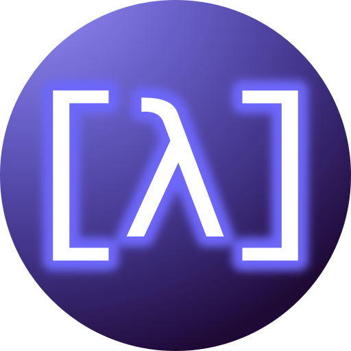

<h1 align="center">Sci-Lisp</h1>

<p align="center">

</p>

<h4 align="center" style="margin-top: 24px">
A Lisp for Scientific Computing written in Rust
</h4>

<p align="center">
<a href="https://github.com/chaploud/sci-lisp/actions/workflows/rust.yml"></a>
</p>


## Features (WIP)

- [x] S-expression
- [x] Clojure-like syntax (), [], {}, etc...
- [x] Numpy-like array slice `([2:-1, -3:] array2d)`
- [ ] Multiparadigm (Functional, Object-Oriented and Procedural)
- [x] REPL
- [x] Run as script
- [ ] Supports exception handling
- [ ] Functionality of IPython, numpy, matplotlib, pandas, scipy
- [ ] Digital Signal Processing (DSP) and Time Series Analysis (TSA) included as standard library
- [ ] Well documented
- [ ] Easy installation (Cross Platform)
- [ ] Great developer experience with VSCode extension

## Philosophy

Let's use **Lisp easily** without thinking too hard!

## Influenced by

- Common Lisp
- Clojure (https://github.com/clojure/clojure)
- Hy (https://github.com/hylang/hy)
- Python (https://github.com/python/cpython)
- Rust (https://github.com/rust-lang/rust)

## Installation

**NOTE:** currently most features are not implemented.

### Build from source code

#### Prerequests

- Latest Rust installation (see https://www.rust-lang.org/tools/install)

#### Commands

```bash
# Clone Repository
git clone https://github.com/chaploud/sci-lisp.git

# build scilisp binary using cargo build
cd sci-lisp
cargo build --release  # => target/release/scilisp
```

- You can execute `scilisp` binary

### Get prebuild binary

#### Windows

Not distributed yet.

#### Mac

Not distributed yet.

#### Linux

Not distributed yet.

## Command line options

```bash
scilisp  # launch REPL
scilisp xxx.lisp  # run as script
```

## Sci-Lisp code examples

See `examples/example.lisp`.

```clojure
; Comment

;; ===== Literal
"abc\n"             ; string
#"[0-9]+"           ; regular expression
false               ; false
true                ; true
nil                 ; nil
-999                ; i64
-3.14e15            ; f64
nan                 ; Not a Number
inf                 ; positive infinity
-inf                ; negative infinity
-0.0                ; negative zero
:keyword            ; keyword symbol
'symbol             ; quoted symbol

;; falsy value is only 'false' and 'nil'
;; "", '(), [], {}, #{}, 0, nan => all truthy

;; ===== Collection
; comma is treated as whitespace
'(1, "a", :b)       ; list
[1.0, 2.0, 3.0]     ; vector
{:a "a", :b "a"}    ; map (holds the insersion order)
#{:a, :b, :c}       ; set (holds the insersion order)

;; ===== Function Call
(type [1, 2, 3])             ; show type
(time (+ 1 2))               ; measure processing time
(print {:a 2, :b 3})         ; print any

;; ===== Variable Binding
(def a "abcde")              ; variable (mutable, global scope)
(const C [1, 2, 3])          ; constant value (immutable)

([0:2] a)                    ; slicing => "ab"
([-1] C)                     ; back => 3

(let [a 2]                   ; bind variable (local scope)
  (set! a 3)                 ; assign(destructive)
  a)                         ; => 3

;; ===== Function
(defn sum [a b]              ; define function
 "sum two value"             ; docstring
  (print a b)
  (+ a b))

(def sum                     ; bind function using def
  (fn [a b]                  ; anonymous/lambda function
    (return (+ a b)          ; can use early return
    (- a b))))

;; ===== Control Flow
(if (< 2 3)                  ; if
  "true"                     ; true form
  "false")                   ; false form (must)

(when (< 2 3)                ; when
  (do                        ; true form
    (print "2 < 3")          ; do multiple expressions
    "retval"))

(cond                        ; cond
  (< n 0) "negative"         ; (condition) (expresson)
  (> n 0) "positive"
  :else "default")           ; :else (expression)

(def val "hoge")
(switch val                  ; switch
  ["a"]                      ; match "a"
    (print "A")
  ["b", "c"]                 ; match "b" or "c"
    (print "B or C")
  :default                   ; :default (expression)
    (print "DEFAULT"))

(for [i (range 5)]           ; for loop, range
  (print i))

(def a 0)
(while (< a 100)             ; while loop
  (print a)
  (set! a (+ a 1))
  (if (> a 50)
     (break)                 ; break
     (continue)))            ; continue

;; ******************* WIP **********************
;; ===== enum
(enum Grade                       ; define enum
  "Grade Enum"                    ; docstring
  [ECONOMY,
   BUSINESS,
   FIRST])

(def your-grade Grade.FIRST)      ; allow this style

;; ===== struct
(struct Enemy                     ; define struct
  "Enemy Struct"                  ; docstring
  [hp,
   attack])

(def slime
  (Enemy {:attack 2, :hp 20}))    ; using struct
([:attack] slime)                 ; access member => 2
(print slime.attack)              ; allow this style

;; ===== class
(class Animal                     ; define class
  "Animal Class"                  ; docstring

  ;; constructor
  (defn Animal [hp, weight]
    "constructor of Animal"
    (set! self.hp hp)
    (set! self.weight weight))

  ;; member
  (def hp)
  (def weight)
  (defn walk [dist]
    (set! self.hp (- self.hp dist)))
    (format "walk {0}km, HP: {1}",
      dist, self.hp))

(class Dog [Animal]               ; inherit from Animal class
  (defn bow []
    (print "bow!")))

(def dog1 (Dog [100, 200]))       ; instanciate class
(dog1.walk 2)                     ; => "walk 2km, HP: 98"
(dog1.bow)                        ; => nil

;; ===== macro
(macro my-and                     ; define macro
  "Evaluates exprs one at time,
   from left to right."           ; docstring
  ([] true)                       ; multi arity
  ([x] x)
  ([x & next]                ; variable length argument (& rest)
    `(let [and# ~x]          ; quote(`) and unquote(~)
       (if and#                   ; auto-gensym(xxx#)
         (my-and ~@next)          ; unquote splicing(~@)
         and#))))

(my-and "a" "b" "c")              ; => "c"
;; ******************************************

;; ===== Built-in Functions

;; Arithmetic
(inc 1)              ; add 1
(dec 1)              ; subtract 1
(+ 1 1)              ; Add
(- 1 1)              ; Subtract
(* 2 3)              ; product
(/ 1 2)              ; devide (float)
(// 1 2)             ; devide
(% 3 2)              ; remainder

;; Compare
(= 2 2)              ; equal
(is [1, 2] [1, 2])   ; ident (=> false)
(< 2 3)              ; less
(<= 2 3)             ; less equal
(> 2 3)              ; greater
(>= 2 3)             ; greater equal

;; Logical
(and true false)     ; and
(or true false)      ; or
(xor true true)      ; xor
(not false)          ; not

;; Math
(abs -2)             ; absolute value
(abs [-2, 3, 4])     ; absolute value applying to vector
(cos 2.0)            ; cosine
(sin 2.0)            ; sine
(tan 2.0)            ; tangent
(acos 2.0)           ; arccosine
(asin 2.0)           ; arcsine
(atan 2.0)           ; arctangent
(log 2.0)            ; log_e
(log10 2.0)          ; log_10
(rand)               ; rondom value 0.0 to 1.0
(randint 30)         ; random integer 0 to n

;; Utility
(type [1, 2, 3])              ; show type
(time (+ 1 2))                ; measure processing time
(print {:a 2, :b 3})          ; print any
(printf "{0:03}kg" 56)        ; print format

;; String
(format "π: {:.2}" 3.1415)    ; format string
(len "abcde")                 ; length of string
(join [1, 2, 3] ",")          ; join (=> "1,2,3")
(in? "a" "12aabc32")          ; is string in string?
(upper "abc")                 ; upper-case
(lower "DEF")                 ; lower-case

;; Regular Expression
(find #"[0-9]+" "aa123a")             ; => "123"
(match #"hello, (.*)" "hello, world") ; => ["hello, world", "world"]

;; Vector
(shape [[1, 2], [3, 4], [5, 6]])      ; shape of vector (=> [3, 2])
(len [1, 2, 3])                       ; length of vector
(sum [1, 2, 3])                       ; sum of vector
(mean [1, 2, 3])                      ; mean of vector
(max [1, 2, 3])                       ; max of vector
(min [1, 2, 3])                       ; min of vector
(in? 2 [1, 2, 3])                     ; is element in vector?
(some? [false, true, false])          ; return true if some true
(every? [false, true, false])         ; return true if all true
(sort [3, 1, 2])                      ; sort (non-destructive)
(shuffle [3, 1, 2])                   ; shuffle (non-destructive)
(push [3, 1, 2] 4)                    ; push_back (non-destructive)
(cons [3, 1, 2] 4)                    ; push_front (non-destructive)

(def v [3, 1, 2])
(sort! v)                             ; sort (destructive)
(shuffle! v)                          ; shuffle (destructive)
(push! v 4)                           ; push_back (destructive)
(cons! v 4)                           ; push_front (destructive)
```

## Pronunciation

`/sai lisp/`

## Pull requests are welcome!

Especially, please fix mistakes in English in source codes.

## VSCode Extension

Currently only syntax highlight supported.

- [GitHub](https://github.com/chaploud/Sci-Lisp-vscode-extension)
- [Visual Studio Marketplace](https://marketplace.visualstudio.com/items?itemName=chaploud.sci-lisp)


